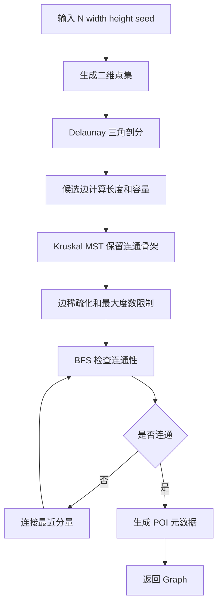
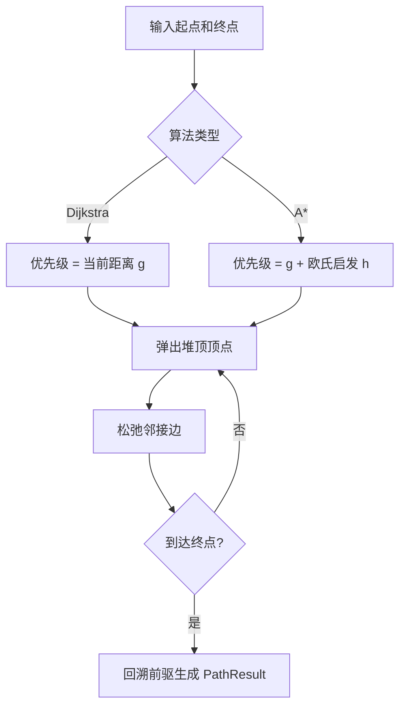
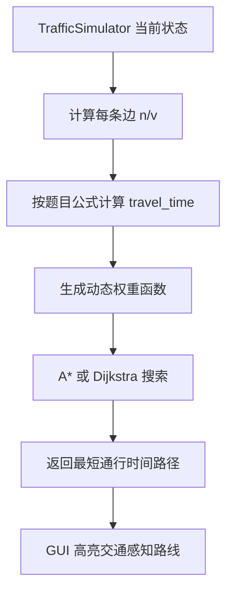

# 算法与复杂度分析

本文档供成员 A 写报告、准备答辩和向成员 C 提供素材。项目核心目标是把导航系统抽象为大规模带权无向图，并围绕 F1-F5 实现空间查询、路径规划、交通模拟和交通感知路径。

## 1. 图结构：邻接表

地图抽象为 `Graph`：

- `Vertex(id, x, y, metadata)`：地点坐标和扩展元数据，阶段四 POI 保存在 `metadata["poi"]`。
- `Edge(u, v, length, capacity, current_cars)`：道路长度、容量、当前车辆数。
- `Graph`：用 `dict[int, list[Edge]]` 保存邻接表，用 `dict[int, Vertex]` 保存顶点。

选择邻接表的原因：

- 10000 个顶点如果使用邻接矩阵，需要约 10000² 个布尔/数值单元，空间浪费明显。
- 导航路网是稀疏图，平均度数较小，邻接表空间复杂度为 `O(V + E)`。
- 遍历某个顶点的道路只需 `O(deg(v))`，适合 Dijkstra、A* 和交通模拟。

## 2. 地图生成：Poisson/Grid + Delaunay + Kruskal MST

生成流程：

1. 使用泊松盘采样生成分布较均匀的二维点；空间不足时回退到网格抖动采样。
2. 使用 `scipy.spatial.Delaunay` 对点集做三角剖分，获得天然无交叉的候选道路。
3. 通过 Kruskal 算法提取最小生成树，确保连通骨架。
4. 稀疏化候选边，限制最大度数并保留 MST 边。
5. 检查连通性，如有分量则连接最近分量。
6. 给边赋容量，给部分顶点赋 POI 元数据。

为什么用 Delaunay：

- 简单随机连边或 K 近邻连边容易出现几何交叉。
- Delaunay 三角剖分连接自然邻近点，边集数量约为 `O(V)`，适合作为道路候选集。
- 在二维平面中它生成的是平面图，视觉上更像道路网络。

Kruskal MST 使用并查集思想：按边长排序，依次加入不会造成环的边，得到连接所有顶点且总长度较小的骨架。

## 3. KD-Tree 空间索引

KD-Tree 用于 F1 和 F2：

- `query_k_nearest(x, y, k)`：查询最近顶点。
- `query_range(x_min, y_min, x_max, y_max)`：查询视口内顶点。
- `query_representative(...)`：视口缩小时按网格抽代表点。
- 阶段四新增 POI KD-Tree，只索引带 `metadata["poi"]` 的顶点。

建树方法：

- 每层交替按 `x`、`y` 切分。
- 使用 quickselect 找中位数，避免每层完整排序。
- 递归构造左右子树。

K 近邻查询：

- 维护大小为 `k` 的最大堆。
- 先访问查询点所在一侧，再根据到分割线的距离决定是否回溯另一侧。
- 平均查询复杂度接近 `O(k log V)`，明显快于每次全图扫描。

## 4. 最短路径：Dijkstra 与 A*

`pathfinding.py` 提供统一的 `shortest_path()`：

- `algorithm="dijkstra"`：稳定、通用，使用 `heapq` 最小堆。
- `algorithm="astar"`：使用欧氏距离作为启发式函数，适合二维地图。

Dijkstra：

- 初始化起点距离为 0。
- 每次从堆中取当前最小距离顶点。
- 松弛所有邻边，记录前驱节点。
- 结束后从终点回溯得到路径。

A*：

- 在 Dijkstra 的 `g(n)` 基础上加入启发式 `h(n)`。
- 这里 `h(n)` 使用当前点到终点的欧氏距离。
- 因为道路权重不小于欧氏距离启发式，启发式可采纳，能保证最优性。

交通感知路径复用同一套算法，只替换边权函数：静态路径使用 `edge.length`，交通路径使用 `edge.travel_time()` 或模拟器的 `weight_func()`。

## 5. 交通模型

题目给定道路通行时间：

```text
t = c * L * f(n / v)
f(x) = 1, x <= threshold
f(x) = 1 + exp(x), x > threshold
```

其中：

- `L`：道路长度。
- `v`：道路容量。
- `n`：当前车辆数。
- `c`：常数因子。
- `threshold`：拥堵阈值。

项目中 `TrafficSimulator` 使用混合模拟：

- 背景流量：每条边保存连续车辆数，保证大地图上拥堵分布稳定。
- 显式车辆：保存车辆路线、当前边、进度、状态，供 GUI 动态绘制。
- 每步模拟会推进车辆、更新背景流、同步 `Edge.current_cars`。
- GUI 视口刷新只为当前视口内道路生成 `EdgeTrafficState`，避免每次拖拽/缩放都构造全图交通快照。

拥堵等级：

- 0：畅通。
- 1：缓行。
- 2：拥堵。
- 3：严重拥堵。

成员 B 可以直接用 `EdgeTrafficState.level` 给道路上色。

## 6. 复杂度表

| 模块/操作 | 时间复杂度 | 空间复杂度 | 说明 |
|---|---:|---:|---|
| 邻接表存储 | - | `O(V + E)` | 稀疏图适用 |
| 添加顶点 | `O(1)` | `O(1)` | 字典写入 |
| 添加边 | `O(1)` 均摊 | `O(1)` | 同时写两端邻接表 |
| BFS 连通性检查 | `O(V + E)` | `O(V)` | 用于生成验收 |
| Delaunay 三角剖分 | `O(V log V)` | `O(V)` | 由 scipy 实现 |
| Kruskal MST | `O(E log E)` | `O(V)` | 边排序 + 并查集 |
| KD-Tree 建树 | `O(V log V)` 平均 | `O(V)` | quickselect 中位切分 |
| KNN 查询 | `O(k log V)` 平均 | `O(k + log V)` | 最坏可能退化到 `O(V)` |
| 范围查询 | `O(sqrt(V) + m)` 平均 | `O(m)` | `m` 为返回点数 |
| Dijkstra | `O((V + E) log V)` | `O(V)` | 二叉堆实现 |
| A* | 最坏 `O((V + E) log V)` | `O(V)` | 实测访问点通常更少 |
| 全图交通快照 | `O(E)` | `O(E)` | 每条边生成状态 |
| 视口交通状态 | `O(E_view + C)` | `O(E_view)` | `E_view` 为当前视口道路数 |
| 单步交通模拟 | `O(E + C log V)` 近似 | `O(E + C)` | 背景流按更新间隔批量推进，动态转向复用边通行时间缓存 |
| POI 查询 | `O(P log P)` 建树，查询平均 `O(k log P)` | `O(P)` | `P` 为 POI 数量 |

## 7. Mermaid 流程图

### 地图生成流程



### 路径搜索流程



### 交通感知路径流程



## 8. 答辩要点

- 本项目没有用邻接矩阵，而是使用邻接表，因为 10000 点地图是稀疏图，邻接表空间更优。
- 地图生成不是随机乱连，而是用 Delaunay 保证道路不产生明显交叉，再用 MST 保证连通性。
- KD-Tree 是为了支持 F1 最近 100 点和 F2 视口查询，避免每次 GUI 交互都扫描 10000 个点。
- Dijkstra 和 A* 共用同一套 `PathResult` 和权重函数接口，静态路径与交通路径只是权重策略不同。
- 交通模拟严格使用题目给出的 `c * L * f(n/v)` 公式，并把拥堵等级暴露给 GUI 上色。
- 阶段四的 `NavigationEngine` 是给成员 B 的稳定边界；B 不需要理解底层算法也能接入 GUI。

## 9. 报告可引用段落

本项目将城市导航地图抽象为带权无向图，其中地点为顶点、道路为边，边权既可以表示几何距离，也可以表示交通状态下的动态通行时间。图采用邻接表存储，以适应 10000 个以上顶点的稀疏道路网络。地图生成部分使用 Delaunay 三角剖分构造无明显交叉的候选道路，再通过 Kruskal 最小生成树和连通性修复保证全图连通。空间查询部分实现 KD-Tree，以支持最近邻查询和视口范围查询。路径规划部分实现 Dijkstra 与 A* 算法，并通过权重函数参数化复用同一套搜索框架，从而同时支持普通最短路径和交通感知最短路径。

交通模拟部分根据题目给出的通行时间公式 `t = c * L * f(n/v)` 建模，其中道路长度和容量为固定属性，当前车辆数随模拟步动态变化。系统维护每条边的拥堵比例、拥堵等级和通行时间，并将这些状态通过统一 API 返回给 GUI 层。该设计既满足课程对数据结构和算法的考核要求，也满足界面展示、文件 I/O、动态交通可视化和测试验证等工程要求。
